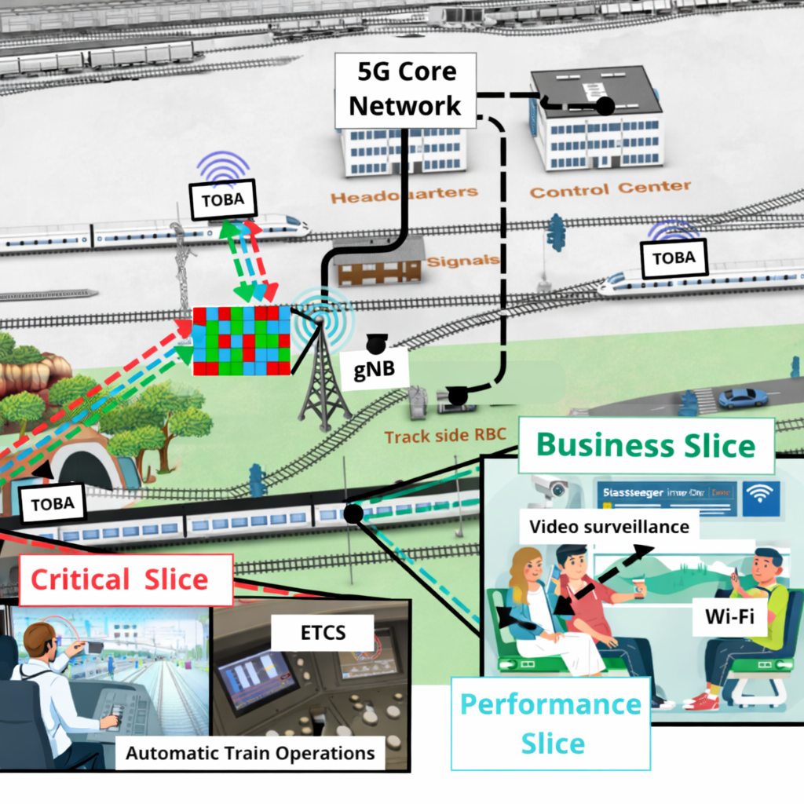
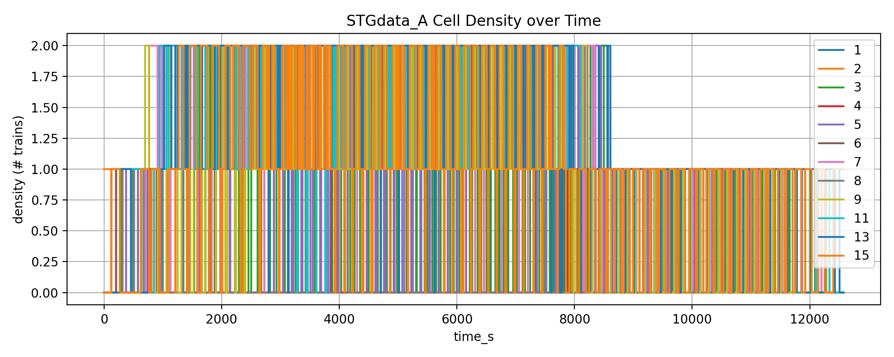
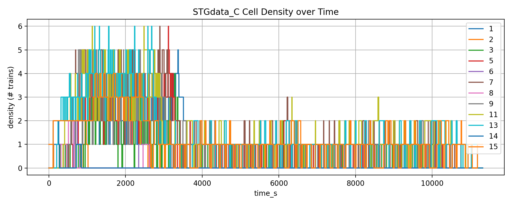

# Spatio-temporal dataset of FRMCS (5G) traffic from Railway network

This repository contains a cleaned and traffic-enriched railway communication dataset prepared for research on future railway mobile communication systems. It is derived from [ETCS and railway network raw observations](https://ieee-dataport.org/documents/etcs-and-railway-network-raw-dataset) collected on the SNCF BPL high-speed railway line in eastern France and turns those raw mobility and radio-context traces into simulation-ready spatio-temporal graph datasets for FRMCS and 5G railway studies.

The repository is organized into three generated scenarios, `STGdata_A`, `STGdata_B`, and `STGdata_C`. Each scenario includes a cell-time graph table and its corresponding set of train-level files. The graph tables aggregate railway cell occupancy, active train identifiers, emergency-stop indicators, average train speed, and generated FRMCS traffic demand over critical and performance slices.

The application-level traffic in this dataset is generated from ETCS events and aligned with train movement over railway radio cells. It should be interpreted as simulation-ready FRMCS traffic derived from real railway traces rather than raw measured user-plane traffic.

This dataset supports studies on railway network slicing, spatio-temporal graph neural networks, traffic forecasting, radio resource management, mobility-driven orchestration, handover analysis, emergency-service prioritization, anomaly detection, and AI/ML optimization for FRMCS and 5G railway systems.



## Repository Content

| Path | Description |
| --- | --- |
| `Raw_BPL/` | Raw ETCS and railway-network traces used to derive the generated STG datasets, organized as `Train -> Dates -> CSV files`. |
| `_base_train_runs/` | Cleaned and aligned per-train runs derived from the raw traces. |
| `make_dataset.ipynb` | End-to-end notebook used to prepare base runs, generate application traffic, build STG datasets, and add subband radio features. |
| `cell_gnb_relation.csv` | Railway cell to gNB mapping used by the STG generator. The current setup maps 16 railway cells to 8 gNBs. |
| `FRMCS_apps_slice_requirementstandard.xlsx` | Traffic requirement table used to define slice class, nominal rates, latency, reliability, 5QI, and packet-delay budget targets for each FRMCS application. |
| `STG_input_train_feature_dictionary.csv` | Feature dictionary for the per-train input files. |
| `STG_cell_time_feature_dictionary.csv` | Feature dictionary for the aggregated cell-time datasets. |
| `STGdata_A/` | Baseline single-track spatiotemporal traffic generation dataset. |
| `STGdata_B/` | Dense-injection track-aware dataset with Track B capacity rules. |
| `STGdata_C/` | Dense-injection dataset with double-track capacity inside the configured multi-track area. |


## Standards and Technical Basis

The traffic model and radio-feature construction in this repository are grounded in the following materials.

- [FRMCS_apps_slice_requirementstandard.xlsx](FRMCS_apps_slice_requirementstandard.xlsx): local requirement table used directly by the generator for application classes, rates, 5QI, latency, reliability, and PDB values.
- 3GPP TS 36.213, *Evolved Universal Terrestrial Radio Access (E-UTRA); Physical layer procedures*: used as the reference for the resource-block-group interpretation behind the subband CQI representation.  
  Link: https://portal.3gpp.org/desktopmodules/Specifications/SpecificationDetails.aspx?specificationId=2427
- A. K. Thyagarajan et al., *SNR-CQI Mapping for 5G Downlink Network*, 2021 IEEE Asia Pacific Conference on Wireless and Mobile (APWiMob): used for the CQI-to-SNR lookup adopted in the notebook.  
  Link: https://ieeexplore.ieee.org/document/9435258
  
## Generation Pipeline

The notebook follows four main stages.

### 1. Base Train Preparation

The first stage loads cleaned `RBC_1` files from `Raw_BPL/`, keeps the railway section defined in `cell_gnb_relation.csv`, rebuilds the common train features needed downstream, orders runs by start time, and writes the resulting base files into `_base_train_runs/`.

Current repository content includes:

- `183` base train run files in `_base_train_runs/`
- mapped railway section covering `16` cells and `8` gNBs

### 2. Event-Based FRMCS Traffic Generation

Application traffic is synthesized on top of each base train run at a `0.25 s` step. Each row receives per-application downlink and uplink traffic in kilobits, plus slice totals.

For each train row, the generated traffic follows:

```text
traffic_kb_per_row
= nominal_rate_kbps × 0.25 s × activity_factor × radio_mobility_factor × priority_factor
```

The generator combines three layers:

1. Radio and mobility scaling from handover context, channel quality, speed, and balise distance.
2. Priority scaling from `CES` and `EStop`, boosting critical services and reducing performance services during emergency conditions.
3. Application activity profiles driven by operating mode, station-arrival transitions, and emergency-trigger edges.

#### Traffic Basis

The nominal rates and service classes come from [FRMCS_apps_slice_requirementstandard.xlsx](FRMCS_apps_slice_requirementstandard.xlsx). The implemented high-speed profile uses the following application model.

| Application | Slice | Nominal DL / UL | Activity rule in the notebook |
| --- | --- | --- | --- |
| `voice` | Critical | `23.85 / 23.85 kbps` | Burst triggered by emergency-condition rising edges. |
| `etcs` | Critical | `5 / 1.25 kbps` | Active across the full train run. |
| `ato` | Critical | `1 / 0.25 kbps` | Active only when `M_MODE == "Full Supervision"`. |
| `remote_engine_ctrl` | Critical | `25 / 100 kbps` | Defined in the requirement table but forced to zero in the current high-speed profile. |
| `pub_warn` | Critical | `2 / 2 kbps` | Short burst after emergency-condition rising edges. |
| `telemetry_nc` | Performance | `1 / 5 kbps` | Always active. |
| `equip_ctl` | Performance | `1 / 1 kbps` | Always active. |
| `asset_tel` | Performance | `4 / 4 kbps` | Always active. |
| `pis` | Performance | `5 / 5 kbps` | Low background load with stronger burst at station-arrival transitions. |
| `video_surv` | Performance | `300 / 3000 kbps` | Emergency-triggered burst, with the uplink dominant and a light downlink control load. |

#### Implemented Event Parameters

- Row interval: `0.25 s`
- Voice burst: `120` rows
- Public-warning burst: `40` rows
- Video-surveillance burst: `100` rows
- PIS station burst: `8` rows
- Station-arrival detection: speed drop from `> 30 km/h` to `< 5 km/h`
- Critical multipliers: `CES = 1.15`, `EStop = 1.45`
- Performance multipliers: `CES = 0.925`, `EStop = 0.65`

The notebook writes the generated traffic back into the per-train files as:

- per-application columns such as `voice_DL_kb`, `etcs_UL_kb`, `video_surv_UL_kb`
- slice totals `critical_DL`, `critical_UL`, `perform_DL`, and `perform_UL`


## Included Datasets and Figures

### STGdata_A

- Aggregated data: [STGdata_A/data/STGdata_A.csv](STGdata_A/data/STGdata_A.csv)
- Train timelines: [STGdata_A/input_trains/](STGdata_A/input_trains/)



### STGdata_B

- Aggregated data: [STGdata_B/data/STGdata_B.csv](STGdata_B/data/STGdata_B.csv)
- Train timelines: [STGdata_B/input_trains/](STGdata_B/input_trains/)

### STGdata_C

- Aggregated data: [STGdata_C/data/STGdata_C.csv](STGdata_C/data/STGdata_C.csv)
- Train timelines: [STGdata_C/input_trains/](STGdata_C/input_trains/)



## Feature Dictionaries

Two dictionaries are included to document the generated files.

- [STG_input_train_feature_dictionary.csv](STG_input_train_feature_dictionary.csv) describes the train-level inputs and outputs, including radio features, ETCS state variables, per-application traffic columns, slice totals, and the seven subband CQI/SNR features.
- [STG_cell_time_feature_dictionary.csv](STG_cell_time_feature_dictionary.csv) describes the aggregated cell-time dataset used for spatiotemporal graph and traffic-learning workflows.


## Citation

Use the following citation for this dataset.

```bibtex
@data{8nb3-zb68-26,
  doi = {10.21227/8nb3-zb68},
  url = {https://dx.doi.org/10.21227/8nb3-zb68},
  author = {David KULE MUKUHI and Fawzi KHOURI and Rodrigue Fargeon and Leo Mendiboure and Rami Langar and Sylvain Cherrier and Marion Berbineau and Pierre-Yves Petton},
  publisher = {IEEE Dataport},
  title = {Spatio-temporal dataset of FRMCS (5G) traffic from Railway network},
  year = {2026}
}
```

Plain citation:

David KULE MUKUHI, Fawzi KHOURI, Rodrigue Fargeon, Leo Mendiboure, Rami Langar, Sylvain Cherrier, Marion Berbineau, Pierre-Yves Petton, *Spatio-temporal dataset of FRMCS (5G) traffic from Railway network*, IEEE Dataport, April 20, 2026, doi:10.21227/8nb3-zb68

For experiments that use the generated `STGdata_A`, `STGdata_B`, or `STGdata_C` files from this repository, cite the dataset above and reference the repository version or commit hash used in the experiment.

## IEEE DataPort Page

Dataset page: https://ieee-dataport.org/documents/spatio-temporal-dataset-frmcs-5g-traffic-railway-network
